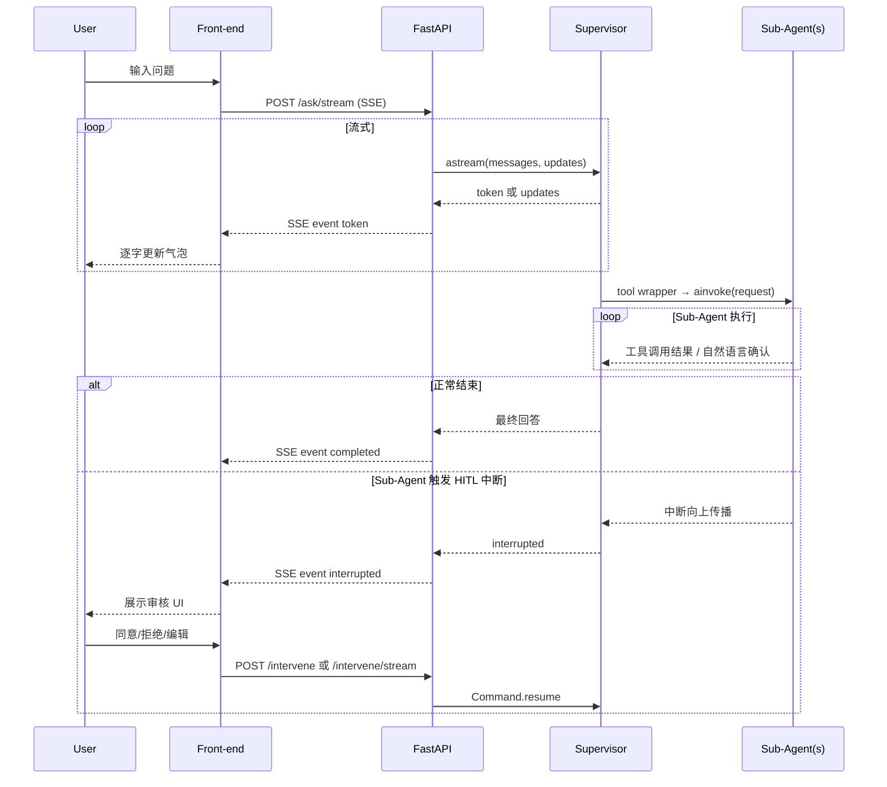

# LangChain V1.x 多智能体 API 服务（Supervisor + Agents as Tools 模式）

## 1、案例介绍

本期视频为大家分享的用例 **15_MultiAgentAPIServerAgentsAsTools** 是在 **14_AgentAPIServerWithPlaywright**（流式输出 + HITL + Skill + Playwright）能力不变的前提下，参考 [LangChain 官方文档 subagents-personal-assistant](https://docs.langchain.com/oss/python/langchain/multi-agent/subagents-personal-assistant) 将**单 Agent 全能架构**演进为 **Agents as Tools** 多智能体架构，外部 HTTP 接口形态与 EP14 **完全一致**

涉及到的源码、操作说明文档等全部资料都是开源分享给大家的，大家可以在本期视频置顶评论中获取免费资料链接进行下载

本期用例在 EP14 的基础上新增/强调的核心功能包含：

- **Agents as Tools 多智能体架构**：将单一全能 Agent 拆分为 1 个 Supervisor + 3 个专属 Sub-Agent
  - **Supervisor Agent**：持有 checkpointer 与 store，接收用户请求，通过工具路由委派至对应 Sub-Agent
  - **Web Agent**：专注浏览器操作（Playwright），处理网页访问、文本提取、链接提取等任务
  - **Knowledge Agent**：专注文档检索（MCP RAG Server + Milvus），回答知识库相关问题
  - **Task Agent**：专注日常任务执行（天气查询、地理位置、技能调用等）
- **Sub-Agent 工具包装**：每个 Sub-Agent 被 `@tool` 装饰器包装为高层工具，Supervisor 通过调用这些工具委派任务
- **并行委派能力**：Supervisor LLM 可在同一轮推理中并行调用多个 Sub-Agent 工具（如同时查天气并检索文档）
- **HITL 中断传播**：Sub-Agent 内部工具触发中断后，经 `@tool` 包装器向上传播至 Supervisor，由 Supervisor 统一的 checkpointer 捕获和保存
- **应用生命周期优化**：所有 Sub-Agent 在 FastAPI `lifespan` 中一次性构建并全程复用，不再每请求重新实例化

### 1.1 架构与数据流




### 1.2 多智能体设计思想

**Agents as Tools** 是 LangChain 官方文档描述的 Supervisor 多智能体模式，核心思路是将不同领域的工具和提示词分别交给专属 Sub-Agent 管理，Supervisor 只做高层路由决策。系统分为三层：

- **底层**：各领域 API 工具（Playwright、天气接口、RAG 检索等），需要结构化输入
- **中间层**：Sub-Agent（Web / Knowledge / Task），接受自然语言请求，调用底层工具后返回自然语言确认
- **顶层**：Supervisor Agent，接收用户原始请求，通过选择高层包装工具（`web_agent_tool` / `knowledge_agent_tool` / `task_agent_tool`）进行路由，并汇总结果

这种分层设计的优势在于：每层职责单一、可独立测试迭代；增加新领域无需改动现有逻辑；Supervisor 不需要从数十个底层工具中做选择，大幅降低路由错误概率

采用 **Agents as Tools** 模式，通过多层抽象实现关注点分离，核心设计思路如下：

1. **工具分层路由**
  Supervisor 只持有三个高层工具（`web_agent_tool`、`knowledge_agent_tool`、`task_agent_tool`），LLM 根据用户意图选择工具路由，无需从数十个底层工具中做选择，路由精度显著提升
2. **Sub-Agent 无状态化**
  Sub-Agent 不持有 checkpointer，每次工具调用独立执行；状态由 Supervisor 的 checkpointer 统一管理，实现状态与执行的解耦
3. **configurable 透传机制**
  工具包装器在调用 `sub_agent.ainvoke()` 时，显式将 Supervisor 的 `config["configurable"]`（含 `user_id`、`thread_id` 等）传递给 Sub-Agent，确保上下文在多层调用链中不丢失
4. **HITL 跨层传播**
  Sub-Agent 内部工具触发中断时，中断异常经 `@tool` 包装器自动向上传播，由 Supervisor 的 checkpointer 捕获并持久化；前端仍通过同一套 `/intervene` 接口恢复执行，用户无感知多层结构
5. **并行委派**
  当用户请求同时涉及多个领域时，Supervisor LLM 可在同一轮推理中并行调用多个 Sub-Agent 工具，减少总响应时延

### 1.3 SSE 事件格式（每行 `data: <JSON>\n\n`）


| type        | 说明      | 示例                                                                                                    |
| ----------- | ------- | ----------------------------------------------------------------------------------------------------- |
| token       | 模型文本片段  | `{"type": "token", "content": "你好"}`                                                                  |
| tool_output | 工具节点返回  | `{"type": "tool_output", "content": "工具执行结果..."}`                                                     |
| completed   | 正常结束    | `{"type": "completed", "result": "完整回答文本"}`                                                           |
| interrupted | HITL 中断 | `{"type": "interrupted", "interrupt_details": { "action_requests": [...], "review_configs": [...] }}` |


## 2、准备工作

### 2.1 集成开发环境搭建

anaconda提供python虚拟环境,pycharm提供集成开发环境

具体参考如下视频:  
【大模型应用开发-入门系列】集成开发环境搭建-开发前准备工作  
[https://www.bilibili.com/video/BV1nvdpYCE33/](https://www.bilibili.com/video/BV1nvdpYCE33/)  
[https://youtu.be/KyfGduq5d7w](https://youtu.be/KyfGduq5d7w)

### 2.2 大模型LLM服务接口调用方案

(1)gpt大模型等国外大模型使用方案  
国内无法直接访问，可以使用Agent的方式，具体Agent方案自己选择  
这里推荐大家使用:[https://nangeai.top/register?aff=Vxlp](https://nangeai.top/register?aff=Vxlp)

(2)非gpt大模型方案 OneAPI方式或大模型厂商原生接口

(3)本地开源大模型方案(Ollama方式)

具体参考如下视频:  
【大模型应用开发-入门系列】大模型LLM服务接口调用方案  
[https://www.bilibili.com/video/BV1BvduYKE75/](https://www.bilibili.com/video/BV1BvduYKE75/)  
[https://youtu.be/mTrgVllUl7Y](https://youtu.be/mTrgVllUl7Y)

## 3、项目初始化

关于本期视频的项目初始化请参考本系列的入门案例那期视频，视频链接地址如下:

【EP01_快速入门用例】2026必学！LangChain最新V1.x版本全家桶LangChain+LangGraph+DeepAgents开发经验免费分享  
[https://youtu.be/0ixyKPE2kHQ](https://youtu.be/0ixyKPE2kHQ)  
[https://www.bilibili.com/video/BV1EZ62BhEbR/](https://www.bilibili.com/video/BV1EZ62BhEbR/)

### 3.1 下载源码

大家可以在本期视频置顶评论中获取免费资料链接进行下载

### 3.2 构建项目

使用pycharm构建一个项目，为项目配置虚拟python环境  
项目名称：LangChainV1xTest  
虚拟环境名称保持与项目名称一致

### 3.3 将相关代码拷贝到项目工程中

将下载的代码文件夹中的文件全部拷贝到新建的项目根目录下

### 3.4 安装项目依赖

新建命令行终端，在终端中运行如下指令进行安装

```bash
pip install langchain==1.2.1
pip install langchain-openai==1.1.6
pip install concurrent-log-handler==0.9.28
pip install langgraph-checkpoint-postgres==3.0.2
pip install langchain-text-splitters==1.1.0
pip install langchain-community==0.4.1
pip install langchain-chroma==1.1.0
pip install pypdf==6.6.0
pip install mcp==1.25.0
pip install langchain-mcp-adapters==0.2.1
pip install pymilvus==2.6.6
pip install fastapi==0.115.14
pip install gradio==6.5.1
pip install playwright==1.58.0
pip install lxml==6.0.2
pip install beautifulsoup4==4.14.3
```

首次使用 Playwright 请在同一虚拟环境中执行 `**playwright install**`（安装 Chromium）

**注意:** 建议先使用这里列出的对应版本进行本项目脚本的测试，避免因版本升级造成的代码不兼容。测试通过后，可进行升级测试

## 4、功能测试

### 4.1 使用Docker方式运行PostgreSQL数据库和Milvus向量数据库

进入官网 [https://www.docker.com/](https://www.docker.com/) 下载安装Docker Desktop软件并安装，安装完成后打开软件

打开命令行终端，运行如下指令进行部署

- 进入到 postgresql 下执行 `docker-compose up -d` 运行 PostgreSQL 服务
- 进入到 milvus 下执行 `docker-compose up -d` 运行 Milvus 服务

运行成功后可在Docker Desktop软件中进行管理操作或使用命令行操作或使用指令

PostgreSQL数据库可使用数据库客户端软件远程登陆进行可视化操作，这里推荐使用免费的DBeaver客户端软件

- DBeaver 客户端软件下载链接: [https://dbeaver.io/download/](https://dbeaver.io/download/)

### 4.2 功能测试

```bash
# 1、Milvus向量数据库测试
cd milvus
python 01_create_database.py
python 02_create_collection.py
python 03_insert_data.py
python 04_basic_search.py
python 05_full_text_search.py
python 06_hybrid_search.py

# 2、MCP Server测试
cd rag_mcp
python mix_text_search.py
python mcp_start.py
python rag_mcp_server_test.py

# 3、Agent 测试
python agent_api.py                               # 启动后端API接口服务
python api_test.py                                # 非流式，Task Agent 场景（天气查询）
python api_test.py --stream --debug               # 流式，Task Agent 场景（天气查询）
python api_test.py --knowledge                    # 非流式，Knowledge Agent 场景（文档检索）
python api_test.py --knowledge --stream --debug   # 流式，Knowledge Agent 场景（文档检索）
python api_test.py --web                          # 非流式，Web Agent 场景（网页访问，触发 HITL）
python api_test.py --web --stream --debug         # 流式，Web Agent 场景（网页访问，触发 HITL）
python api_test.py --multi                        # 非流式，多 Agent 协作场景
python api_test.py --multi --stream --debug       # 流式，多 Agent 协作场景
```

