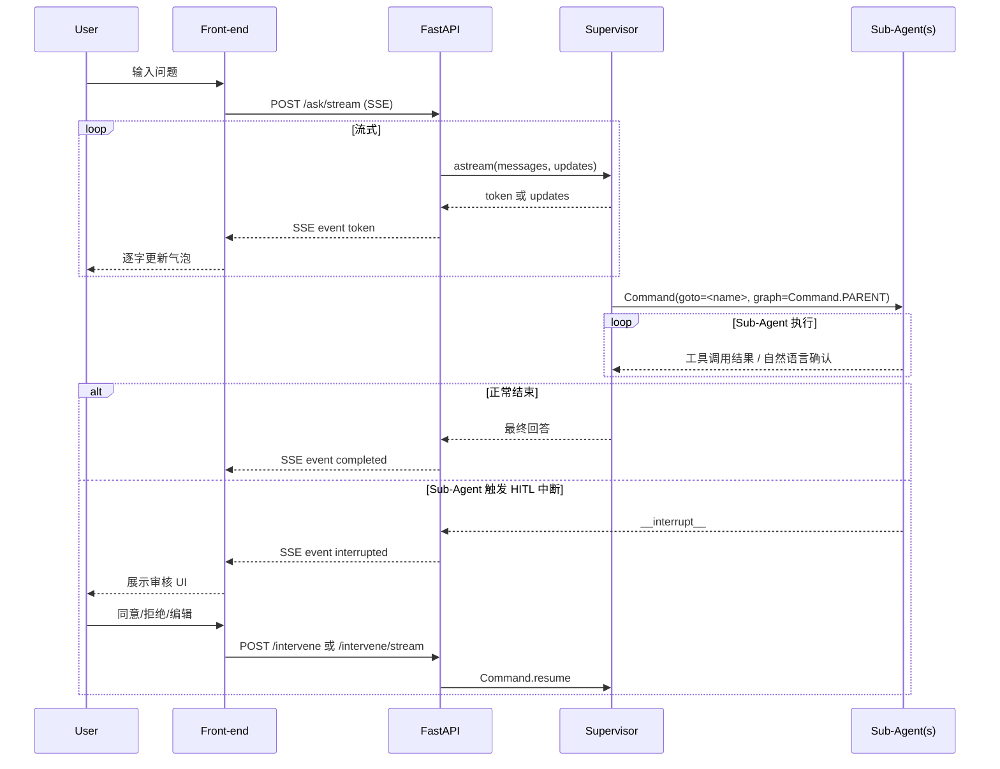

# LangChain V1.x Multi-Agent API 服务（官方 langgraph_supervisor 方案）

## 1、案例介绍

本期视频为大家分享的用例 **16_MultiAgentAPIServer** 是在 **14_AgentAPIServerWithPlaywright**（流式输出 + HITL + Skills + Playwright）能力不变的前提下，将**单 Agent 架构演进为官方 Supervisor 多智能体架构**，外部 HTTP 接口形态与 EP14 **完全一致**。

本用例使用 LangGraph 官方维护的 `langgraph-supervisor`方案，将三个专用 Sub-Agent 注册为 `StateGraph` 中的独立节点，Supervisor 通过 `Command(goto=<name>, graph=Command.PARENT)` 在**图级别**路由委派任务，而非在工具函数内部 `ainvoke` 子调用。

涉及到的源码、操作说明文档等全部资料都是开源分享给大家的，大家可以在本期视频置顶评论中获取免费资料链接进行下载。

本期用例在 EP14 的基础上新增/强调的核心功能包含：

- **官方 `langgraph_supervisor` 多智能体架构**：1 个 Supervisor + 3 个专用 Sub-Agent（Web / Knowledge / Task）
- **图级别路由委派**：Handoff 工具返回 `Command(goto, graph=Command.PARENT)`，由父图完成跳转
- **消息历史合法性保证**：自动维护 `AIMessage + ToolMessage` 配对，避免历史链不合法导致的执行异常
- **并行委派能力**：支持通过 `Send` 并行执行多个 Sub-Agent（适合多领域请求）
- **HITL 中断冒泡与恢复**：Sub-Agent 工具层中断冒泡至 `compiled_supervisor`，前端用 `/intervene` 或 `/intervene/stream` 继续执行
- **生命周期优化**：`compiled_supervisor` 在 FastAPI `lifespan` 中一次性编译并全程复用，多请求通过 `thread_id` 隔离状态

### 1.1 架构与数据流




### 1.2 多智能体设计思想

`langgraph_supervisor` 是围绕 Supervisor pattern 的一套图编排封装：Supervisor 负责高层路由与协调，专用 Sub-Agent 负责各自领域的工具调用与自然语言确认，最终由 Supervisor 汇总结果。与“把 Sub-Agent 包装成工具、在工具内 `ainvoke` 调用”的方案相比，它把委派与控制流上移到 **StateGraph**，可获得更清晰的执行路径与更一致的消息历史管理。

1. 为每个 Sub-Agent 自动生成 `transfer_to_<name>` Handoff 工具
2. Handoff 工具内部返回 `Command(goto=<name>, graph=Command.PARENT)`，在父图（StateGraph）层面路由，而非在工具函数内调用 `ainvoke`
3. 自动维护每次 Handoff 的 `AIMessage + ToolMessage` 消息对，保证对话历史格式合法
4. `output_mode` 控制 Sub-Agent 消息并入 Supervisor 历史的策略（`last_message` 或 `full_history`）
5. HITL 机制（Sub-Agent 工具层）：

- HITL 只在 Sub-Agent 的工具层触发（`HumanInTheLoopMiddleware`，如 `navigate_browser`、`click_element`、`search_documents` 等）
- Sub-Agent 内的 `interrupt()` 冒泡到顶层 `compiled_supervisor`，由 checkpointer 保存中断状态
- 前端通过 `/intervene/stream` 提交决策，`compiled_supervisor` 用 `Command(resume=...)` 恢复执行

6.`compiled_supervisor` 生命周期：

- 在 `lifespan` 中只编译一次，所有请求共用同一个图实例
- 状态隔离由 checkpointer 的 `thread_id` 保证（不同请求使用不同 `thread_id`）

### 1.3 SSE 事件格式（每行 `data: <JSON>\n\n`）


| type        | 说明      | 示例                                                                                                    |
| ----------- | ------- | ----------------------------------------------------------------------------------------------------- |
| token       | 模型文本片段  | `{"type": "token", "content": "你好"}`                                                                  |
| tool_output | 工具节点返回  | `{"type": "tool_output", "content": "工具执行结果..."}`                                                     |
| completed   | 正常结束    | `{"type": "completed", "result": "完整回答文本"}`                                                           |
| interrupted | HITL 中断 | `{"type": "interrupted", "interrupt_details": { "action_requests": [...], "review_configs": [...] }}` |


## 2、准备工作

### 2.1 集成开发环境搭建

anaconda 提供 Python 虚拟环境，PyCharm 提供集成开发环境

具体参考如下视频:
【大模型应用开发-入门系列】集成开发环境搭建-开发前准备工作
[https://www.bilibili.com/video/BV1nvdpYCE33/](https://www.bilibili.com/video/BV1nvdpYCE33/)
[https://youtu.be/KyfGduq5d7w](https://youtu.be/KyfGduq5d7w)

### 2.2 大模型LLM服务接口调用方案

(1) gpt 大模型等国外大模型使用方案
国内无法直接访问，可以使用 Agent 方式，推荐: [https://nangeai.top/register?aff=Vxlp](https://nangeai.top/register?aff=Vxlp)

(2) 非 gpt 大模型方案：OneAPI 方式或大模型厂商原生接口

(3) 本地开源大模型方案（Ollama 方式）

具体参考如下视频:
【大模型应用开发-入门系列】大模型LLM服务接口调用方案
[https://www.bilibili.com/video/BV1BvduYKE75/](https://www.bilibili.com/video/BV1BvduYKE75/)
[https://youtu.be/mTrgVllUl7Y](https://youtu.be/mTrgVllUl7Y)

## 3、项目初始化

关于本期视频的项目初始化请参考本系列的入门案例那期视频:

【EP01_快速入门用例】2026必学！LangChain最新V1.x版本全家桶LangChain+LangGraph+DeepAgents开发经验免费分享
[https://youtu.be/0ixyKPE2kHQ](https://youtu.be/0ixyKPE2kHQ)
[https://www.bilibili.com/video/BV1EZ62BhEbR/](https://www.bilibili.com/video/BV1EZ62BhEbR/)

### 3.1 下载源码

大家可以在本期视频置顶评论中获取免费资料链接进行下载

### 3.2 构建项目

使用 PyCharm 构建项目，配置虚拟 Python 环境
项目名称：LangChainV1xTest
虚拟环境名称保持与项目名称一致

### 3.3 将相关代码拷贝到项目工程中

将下载的代码文件夹中的文件全部拷贝到新建的项目根目录下

### 3.4 安装项目依赖

新建命令行终端，在终端中运行如下指令进行安装

```bash
pip install langchain==1.2.1
pip install langchain-openai==1.1.6
pip install concurrent-log-handler==0.9.28
pip install langgraph-checkpoint-postgres==3.0.2
pip install langchain-text-splitters==1.1.0
pip install langchain-community==0.4.1
pip install langchain-chroma==1.1.0
pip install pypdf==6.6.0
pip install mcp==1.25.0
pip install langchain-mcp-adapters==0.2.1
pip install pymilvus==2.6.6
pip install fastapi==0.115.14
pip install gradio==6.5.1
pip install playwright==1.58.0
pip install lxml==6.0.2
pip install beautifulsoup4==4.14.3

# 新增：官方多智能体 Supervisor 包
pip install langgraph-supervisor==0.0.31       
```

首次使用 Playwright 请在同一虚拟环境中执行 `playwright install`（安装 Chromium）

**注意：** 建议先使用这里列出的对应版本进行测试，避免因版本升级造成的代码不兼容

## 4、功能测试

### 4.1 使用 Docker 方式运行 PostgreSQL 数据库和 Milvus 向量数据库

进入官网 [https://www.docker.com/](https://www.docker.com/) 下载安装 Docker Desktop 软件并安装，安装完成后打开软件。

打开命令行终端，运行如下指令进行部署：

- 进入到 `postgresql` 下执行 `docker-compose up -d` 运行 PostgreSQL 服务
- 进入到 `milvus` 下执行 `docker-compose up -d` 运行 Milvus 服务

运行成功后可在 Docker Desktop 软件中进行管理操作或使用命令行操作。

PostgreSQL 数据库可使用数据库客户端软件远程登录进行可视化操作，这里推荐使用免费的 DBeaver 客户端软件：

- DBeaver 客户端软件下载链接: [https://dbeaver.io/download/](https://dbeaver.io/download/)

### 4.2 功能测试

```bash
# 1、Milvus向量数据库测试
cd milvus
python 01_create_database.py
python 02_create_collection.py
python 03_insert_data.py
python 04_basic_search.py
python 05_full_text_search.py
python 06_hybrid_search.py

# 2、MCP Server测试
cd rag_mcp
python mix_text_search.py
python mcp_start.py
python rag_mcp_server_test.py

# 3、Agent 测试
python agent_api.py                               # 启动后端API接口服务
python api_test.py                                # 非流式，Task Agent 场景（天气查询）
python api_test.py --stream --debug               # 流式，Task Agent 场景（天气查询）
python api_test.py --knowledge                    # 非流式，Knowledge Agent 场景（文档检索）
python api_test.py --knowledge --stream --debug   # 流式，Knowledge Agent 场景（文档检索）
python api_test.py --web                          # 非流式，Web Agent 场景（网页访问，触发 HITL）
python api_test.py --web --stream --debug         # 流式，Web Agent 场景（网页访问，触发 HITL）
python api_test.py --multi                        # 非流式，多 Agent 协作场景
python api_test.py --multi --stream --debug       # 流式，多 Agent 协作场景

```

